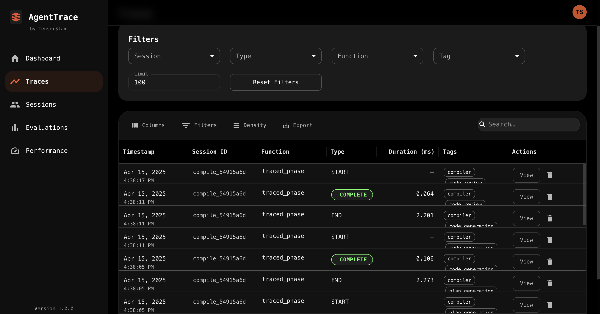
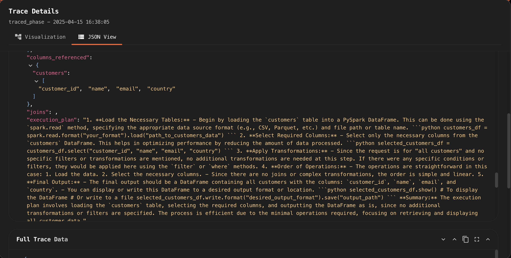

# Spark PostgreSQL Agent

An autonomous agent for natural language transformations on PostgreSQL databases using Apache Spark.

## Features

- Transform natural language requests into executable PySpark code
- Autonomous error detection and self-correction
- Multi-phase compilation for reliable code generation
- Interactive mode for exploration and iterative development
- Context awareness for multi-step workflows
- Validation of transformation results

## Installation

```bash
# Clone the repository
git clone https://github.com/Swagat404/spark_pg_agent_formal.git
cd spark_pg_agent_formal

# Install the package
pip install -e .
```

## Requirements

- Python 3.8+
- Apache Spark 3.1+
- PostgreSQL server
- OpenAI API key or Anthropic API key

## Environment Setup

Create a `.env` file with your API keys and database connection details:

```
# LLM Provider (openai or anthropic)
LLM_PROVIDER=openai
OPENAI_API_KEY=your_openai_api_key
ANTHROPIC_API_KEY=your_anthropic_api_key

# PostgreSQL connection details (optional)
POSTGRES_HOST=localhost
POSTGRES_PORT=5432
POSTGRES_DB=your_database
POSTGRES_USER=postgres
POSTGRES_PASSWORD=postgres
```

## Usage

### Interactive Mode

```bash
# Start the interactive mode
python -m spark_pg_agent_formal.cli interactive

# Or with explicit database connection
python -m spark_pg_agent_formal.cli interactive --pg-host localhost --pg-port 5432 --pg-db your_database
```

### Single Command Execution

```bash
# Execute a specific transformation
python -m spark_pg_agent_formal.cli execute "show me total sales by region"
```

## Example Workflows

### Simple Queries

```
> Show me the top 10 customers by total orders
> List all products with price greater than 50
> Calculate average order value by month
```

### Complex Transformations

```
> Join orders and customers tables, group by customer country, and show average order value
> Find customers who bought product X but not product Y
> Calculate month-over-month growth in sales for each product category
```

### Multi-Step Workflows

```
> Show me sales by region
> Now filter to just the last quarter
> Compare that with the same quarter last year
> Calculate the percentage change
```

## Architecture

The agent architecture follows these key principles:

1. **State Management**: Tracking the agent's state through the transformation process
2. **Multi-phase Compilation**: Breaking down the code generation into discrete phases
3. **Result Detection**: Intelligently identifying the result DataFrame in the executed code
4. **Error Recovery**: Sequential recovery pipeline for handling errors
5. **Memory System**: Tracking context across multiple transformation steps

### System Architecture

The Spark PostgreSQL Agent is structured in multiple layers:

```
+--------------------------------------------------------------+
|                 Spark PostgreSQL Agent Architecture           |
+--------------------------------------------------------------+
                            |
              +-------------v------------+    +----------------+
              |    Interface Layer       |<-->|   CLI Module   |
              +-------------------------+     +----------------+
                          |
+--------------------------------------------------------------+
|                       Core Layer                              |
|                                                               |
|   +-------------------+        +---------------------+        |
|   |TransformationAgent|<------>|    AgentMemory      |        |
|   +-------------------+        +---------------------+        |
|       |       |       |                                       |
|       |       |       v                                       |
|       |       |  +------------+                               |
|       |       |  |SchemaMemory|                               |
|       |       |  +------------+                               |
|       |       |       ^                                       |
|       |       v       |                                       |
|       |  +------------+                                       |
|       |  |DatabaseMgr |                                       |
|       |  +------------+                                       |
|       v                                                       |
|  +---------------------------+                                |
|  |   MultiPhaseLLMCompiler   |                               |
|  |---------------------------|                                |
|  | +------------+ +--------+ |  +-----------+ +------------+ |
|  | |schema_     | |plan_   | |  |SparkExec. | |ResultValid.| |
|  | |analysis    | |gen     | |  +-----------+ +------------+ |
|  | +------------+ +--------+ |                                |
|  | +------------+ +--------+ |                                |
|  | |code_       | |code_   | |                                |
|  | |generation  | |review  | |                                |
|  | +------------+ +--------+ |                                |
|  +---------------------------+                                |
|                                                               |
+--------------------------------------------------------------+
                 |                         ^
                 v                         |
+--------------------------------------------------------------+
|                     External Systems                          |
|  +-------------+  +-------------+  +----------------------+   |
|  |  PostgreSQL |  | Spark       |  | LLM Services         |   |
|  |  Database   |  | Cluster     |  | (OpenAI, Anthropic)  |   |
|  +-------------+  +-------------+  +----------------------+   |
+--------------------------------------------------------------+
```

For complete details, see the `spark_pg_agent_architecture.txt` file.

### Code Execution
 1. The SparkSQL Agent includes a robust execution engine that:
 2. Manages SparkSession lifecycle and configuration
 3. Executes generated PySpark code in a controlled environment
 4. Intelligently identifies and extracts result DataFrames
 5. Handles error recovery and reporting
 6. Provides schema information from PostgreSQL databases


### Multi-Phase Compilation and Tracing




The agent uses a multi-phase compilation process, with each phase traced for debugging:

1. **Schema Analysis**: Analyzes database schema to understand tables and relationships
2. **Plan Generation**: Creates a step-by-step execution plan based on the request
3. **Code Generation**: Transforms the plan into executable PySpark code
4. **Code Review**: Validates the generated code for common issues

#### Tracing System

The tracing system captures detailed information at each phase:

- **Phase Entry/Exit**: Records when each compilation phase starts and ends
- **Intermediate Results**: Captures the output from each phase
- **Error States**: Records any errors encountered during compilation
- **Execution Steps**: Tracks the actual execution of the generated code
- **Result Validation**: Records validation of the results

Each trace is stored with a unique session ID, allowing for:
- Debugging complex transformation workflows
- Analyzing where errors occur in the compilation pipeline
- Improving the agent's performance by identifying bottlenecks

The agent uses **AgentTrace** for capturing, storing, and visualizing traces. The traces are recorded throughout the compilation and execution pipeline, with detailed timing and content information.

steps to use agenttrace dashboard:
- git clone https://github.com/tensorstax/agenttrace.git
- cd agenttrace/frontend
- npm run install:all
- npm run start
- 
This will start:

The backend API server on port 3033
The frontend web interface on port 5173
Open your browser and go to http://localhost:5173 to access the interface.

To see the example traces, set spark_pg_agent_formal/Examples/Traces/spark_pg_agent_traces.db as the database path

Traces can be viewed using:

```bash
# View traces in CLI mode
python -m spark_pg_agent_formal.cli view-traces

# Start the AgentTrace dashboard for interactive exploration
python -m spark_pg_agent_formal.cli start-dashboard
```

The **AgentTrace dashboard** provides an interactive web interface for:
- Viewing all recorded traces in a timeline view
- Drilling down into specific execution phases
- Analyzing performance bottlenecks
- Comparing successful vs. failed executions
- Exporting traces for external analysis

### Memory System

The SparkSQL Agent includes a session-based memory system for maintaining context across multiple queries:

#### Memory Components

- **Conversation History**: Tracks the sequence of user queries and agent responses
- **Transformation Steps**: Stores executed transformations with their code and results
- **Entity Tracker**: Maintains relationships between entities (tables, columns) used in queries
- **Focus Entities**: Tracks which database objects the user is currently working with
- **Named References**: Allows referring to previous results by name or description

#### Memory Features

The memory system enables several key capabilities:

1. **Contextual Understanding**: The agent determines when queries relate to previous results
2. **Reference Resolution**: Understanding queries like "filter that by date" or "now show me the top 10"
3. **Intention Recognition**: Detecting user intentions (filtering, aggregating, sorting) from context
4. **Request Classification**: Categorizing requests as new queries, refinements, or relative references
5. **Transformation Storage**: Indexing and retrieving previous transformation steps

Each transformation is stored with:
- The original request text
- Generated PySpark code
- Tables and columns accessed
- Result summary information
- Timestamp and step number

The memory system is session-based and designed to mimic human-like contextual understanding during a single analysis session. This allows for natural conversations about data without requiring repetition of context in every query.


## License

MIT 
